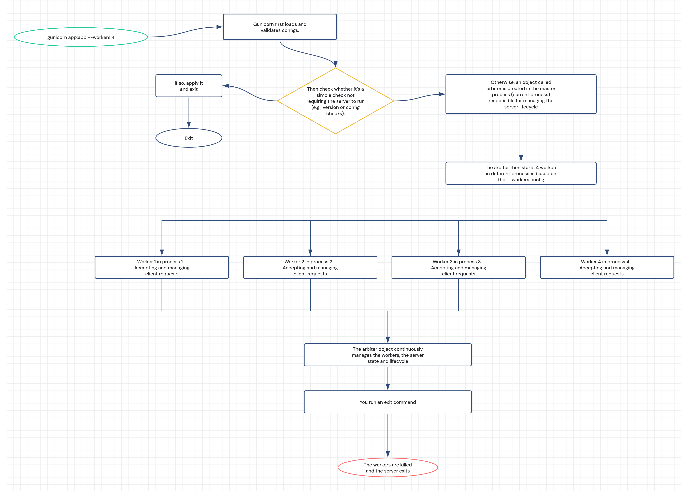

# Gunicorn Internals — v23.0.0

## Terms you should be familiar with

Before diving into the execution flow, it helps to clarify a few core concepts.

### Gunicorn

Gunicorn is a python program that implements a **HTTP server** used to run Python web applications built with frameworks such as **Django**, **Flask**, and recently **FastAPI**.

On its own, a Django or Flask project is just a collection of Python files containing application logic.

Gunicorn provides the missing piece: it **runs the application as a long-lived server**, listens for incoming HTTP requests, and passes those requests to Django, Flask application.

In short:

* your framework defines *what* your application does,
* Gunicorn defines *how* it is run and served in production.

---

### WSGI

Web Server Gateway Interface is a [PEP](https://peps.python.org/pep-3333/) specification that defines how a python web server (e.g. Gunicorn) and a python web application or framework (e.g. Django, Flask) should communicate.

---

### Arbiter

The **Arbiter** is a central class object in Gunicorn and represents the core of the server.

---

### Worker

A **worker** is a class object in Gunicorn that implement the require logic for **accepting and handling client requests**. 
Gunicorn supports different worker implementations (sync, async, thread, etc.)

---

### Process

A **process** is an operating system (OS) abstraction that represents a running program with:

* its own memory space,
* its own Python interpreter,
* and isolated execution from other processes.

---

### Master process and worker processes

When you start Gunicorn, the initial Python process becomes the **master process**.

* The **master process** is the process that contains and runs the [arbiter object](#arbiter)

* **Worker processes** are created by the master process to handler http client requests based on provided `--workers` option.

---

## Execution flow overview

This diagram shows a high-level view of how Gunicorn executes.

Each part of this flow will be explored in detail in the sections that follow, with references to the actual Gunicorn source code.

## 📌 Chapter / Section Titles

1️⃣ **[Startup and Configuration Loading](./1_startup_&_config_load.md)**
(Gunicorn CLI → config parsing & validation)

2️⃣ **[From Configuration to Arbiter Instantiation](./2_arbiter_creation.md)**
(Preparing the server control plane)

3️⃣ **[Initializing the Arbiter and Launching the Server](./3_server_initialization.md)**
(The master process comes to life)

4️⃣ **[Signal Handling in the Master Process](./4_signal_handling.md)**
(Reloads, restarts, shutdowns, worker management)

5️⃣ **[Worker Lifecycle: Base Worker and Subclasses](./5_base_worker.md)**
(How workers are created and managed)

6️⃣ **[HTTP Request Parsing in Gunicorn Sync Worker](./6_sync_worker_&_request_parsing.md)**
(From socket bytes to structured request object)

7️⃣ **[WSGI Request Handling and Application Invocation](./7_wsgi_handling.md)**
(Building `environ`, calling the app, sending a response)
